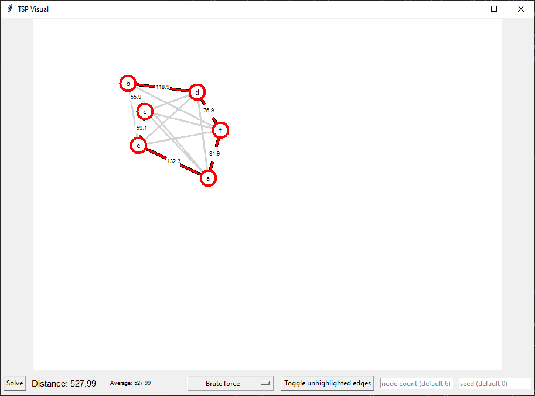

# TSPanalysis
Solving TSP using heuristic optimization algorithms.

This application demonstrates various Travelling Salesman Problem (TSP)
algorithm implementations for solving a TSP. Each one can be ran with some
variations on the nodes to see what each algorithm gives and the shortest
distance it calculated. The application does not show runtime but you could
get a general sense of speed by seeing that some algorithms are instant while
others may take a few seconds (The runtime analysis is covered in the paper in
more detail).



## Instructions

To run the the program run Main.py or the TSP_ANALYSIS.exe.

If running `Main.py`, Python 3.7 and above is needed, as well as the `pandas`
library, which can be installed using pip:
```shell
pyenv exec pip install pandas
```
or
```shell
pip install pandas
```

Alternatively, the precompiled `TSP_ANALYSIS.exe` can be run, which does not have any Python or Python module dependencies.

Once the program is started, an autogenerated graph is displayed. The graph can be zoomed into and panned around (once zoomed in). The bottom of the screen contains a few options, statistics, and text fields which can be interacted with.

The first option is the "solve" command, which will generate a solution with a given algorithm (none chosen initially).

The second option is which command to run. Initially, it will say "Select Algo," which will only disappear when clicked on and an algorithm is chosen (after which the "solve" button may be pressed).

Additionally, there is one more button that disables/enables the gray lines between all nodes.

The two text fields on the right control the starting node count and the seed used to generate the nodes. Once typed, the user must press enter on either text field for the changes to apply (empty or invalid fields will be ignored and instead use the last valid integer).

Note that the runtime analysis is covered in the paper in more detail.
